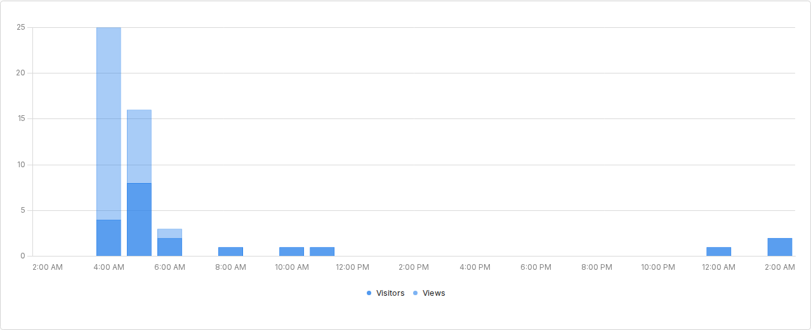

# Jam Tracks Hub

<div align="center">
  <p><strong>A musician-focused workspace for backing tracks, fretboard study, chord exploration, and songwriting support.</strong></p>
  <p>
    <a href="https://jamtrackshub.com">Live Site</a> ·
    <a href="https://www.youtube.com/@Weekly_Backing_Track">YouTube</a> ·
    <a href="#website-analytics">Analytics</a> ·
    <a href="#local-development">Local Development</a>
  </p>
  <p>
    <a href="https://github.com/Passerby-WB/Jam_Tracks_Hub/actions/workflows/ci.yml">
      
    </a>
    <a href="https://jamtrackshub.com">
      
    </a>
    
  </p>
</div>

<p align="center">
  
</p>

Jam Tracks Hub combines original practice tracks with practical tools for understanding harmony, mapping guitar shapes, finding keys, and exporting custom chord progression diagrams. The goal is simple: less menu hunting, more focused practice and songwriting.

All 14 visible product pages are Vue 3 multi-page entries built with Vite. Root HTML files continue to own stable URLs, metadata, analytics loaders, early theme/locale prepaint, and the small set of explicitly retained classic-script bridges described in the [Vue migration record](docs/VUE_MIGRATION.md).

<p align="center">
  
</p>

<!-- UMAMI_ANALYTICS_START -->
## Website Analytics

Daily Umami analytics snapshot for Jam Tracks Hub.

Last updated: Sep 6, 2026, 10:32 AM

<p align="center">
  
</p>
<!-- UMAMI_ANALYTICS_END -->

## Tool Preview

| Page | What it does |
| --- | --- |
| `index.html` | Homepage with the site introduction, quick navigation panels, and contact section. |
| `tracks.html` | Backing track library with multi-key filtering, newest/oldest sorting, and direct slide downloads. |
| `chord-dictionary.html` | Searchable guitar chord dictionary with multiple voicings and shape filters. |
| `scale.html` | Scale explorer for guitar fretboard diagrams and downloadable scale images. |
| `key-finder.html` | YouTube/audio key finder powered by the local or deployed API. |
| `chord-progressions.html` | Chord progression explorer with major/minor key selection and common progression groups. |
| `progression-writer.html` | Custom progression writer with chord inputs, voicing selection, save/download image output, and separated progression/shape export. |
| `song-workspace.html` | Local-first song chart workspace with editing, chord views, Read Mode, Performance Mode, and local exports. |
| `fretboard-trainer.html` | Guitar fretboard practice tool. |
| `legal.html` | Legal and usage policy for local content, exports, and network-backed tools. |
| `privacy-policy.html` | Privacy policy. |

## Interface Gallery

### Backing Track

<p align="center">
  
</p>

### Chord Dictionary

<p align="center">
  
</p>

<p align="center">
  
</p>

### Scale Explorer

<p align="center">
  
</p>

<p align="center">
  
</p>

### Key Finder

<p align="center">
  
</p>

### Chord Progression

C major progression example.

<p align="center">
  
</p>

### Write Your Own Progression

<p align="center">
  
</p>

Image sample

<p align="center">
  
</p>

### Fretboard Trainer

<p align="center">
  
</p>

## Highlights

- Practice with original weekly backing tracks.
- Explore chords, scales, keys, and fretboard positions in one place.
- Build your own chord progressions and export printable diagrams.
- Keep analytics snapshots to understand which tools musicians use most.
- Designed around calm, focused, guitar-friendly workflows.
- All resources are free for people who genuinely want to learn guitar and music theory.

## Project Structure

```text
Jasper-music-main/
  *.html
  styles/
  scripts/
  data/
  assets/
    analytics/
    images/
    readme/
    samples/
    vendor/
  slides/
  downloads/
  src/
  api-server/
  docs/
  tools/
  vite.config.mjs
  .github/workflows/
```

Key files:

| File | Purpose |
| --- | --- |
| `styles/base.css` | Layout foundations, navigation, global utilities. |
| `styles/components.css` | Reusable UI components. |
| `styles/pages.css` | Page-specific sections and tool layouts. |
| `styles/themes.css` | Light/dark theme variables and theme overrides. |
| `styles/chord-dictionary.css` | Chord diagram and chord dictionary-specific styling. |
| `scripts/theme-init.js` | Early theme loading before page paint. |
| `scripts/i18n-init.js` | Early locale selection and no-flash preload before Vue mounts. |
| `src/components/site/SiteShell.vue` | Shared Vue navigation, theme/language controls, footer, and back-to-top composition. |
| `src/views/TracksView.vue` | Vue-owned Track filtering, sorting, card, and download UI. |
| `src/music/chordProgressions.mjs` | Deterministic chord progression and guitar-voicing domain logic. |
| `src/views/ChordProgressionsView.vue` | Vue-owned Chord Progressions page UI and interactions. |
| `src/views/ProgressionWriterView.vue` | Vue-owned custom progression writer UI. |
| `src/services/progressionWriterExport.mjs` | Deterministic progression and chord-shape export logic. |
| `data/tracks.json` | Backing track data source. |

## Local Development

Use Node 22 as specified by `.nvmrc`, then install the locked dependencies:

```bash
npm ci
```

Run the Vite development server for the Vue multi-page frontend:

```bash
npm run dev
```

Key Finder analysis additionally needs the FastAPI backend.

On macOS:

```bash
tools/mac/start_render_local_mac.sh
```

On Windows PowerShell:

```powershell
powershell -ExecutionPolicy Bypass -File ".\tools\windows\start_render_local.ps1"
```

Then open:

```text
http://127.0.0.1:8000/index.html
```

API health check:

```text
http://127.0.0.1:8000/api/health
```

## Checks

Run the unit, JavaScript, and build checks before committing:

```bash
npm test
npm run check
npm run build:cloudflare
npm run verify:cloudflare
```

`npm run build:cloudflare` compiles all 14 visible Vue multi-page entries plus the build-only foundation smoke entry, copies retained static paths into `dist/`, skips oversized source slide PDFs, and verifies Cloudflare output parity.

## Key Finder API

The frontend calls:

```text
/api/health
/api/analyze
```

The API implementation lives in:

```text
api-server/app.py
api-server/detect_key.py
api-server/requirements_api.txt
```

## Tracks Data

Track cards are generated from:

```text
data/tracks.json
```

Example track object:

```json
{
  "id": "W16",
  "title": "New Backing Track in A",
  "key": "A major",
  "style": "Ballad",
  "bpm": "85",
  "youtubeUrl": "https://youtu.be/...",
  "slidesUrl": "slides/w16.html",
  "downloadUrl": "slides/W16_New_Backing_Track_in_A.pdf"
}
```

## Automation

| Workflow | Purpose |
| --- | --- |
| `.github/workflows/ci.yml` | Runs JavaScript syntax checks and Cloudflare static build checks. |
| `.github/workflows/umami-analytics.yml` | Creates analytics issue reports when Umami API access is configured. |
| `.github/workflows/umami-readme-screenshot.yml` | Captures the public Umami dashboard and updates this README daily. |

Analytics screenshots:

```text
assets/analytics/umami-dashboard.png
assets/analytics/history/YYYY-MM-DD.png
```

More details:

```text
docs/UMAMI_ANALYTICS_ACTION.md
docs/GITHUB_WORKFLOW.md
docs/SUBSCRIBE_SETUP.md
```

## Roadmap

- Progression Writer save upgrade: load saved progressions, duplicate, clear all, and export JSON.
- SEO and sharing previews for each tool page, especially Progression Writer.
- Full light/dark consistency sweep for forms, modals, hover states, disabled states, downloads, and selections.

## License And Ownership

Jam Tracks Hub is maintained by Jasper Hsu. Original tracks, images, and exported practice assets belong to Jam Tracks Hub unless otherwise noted.
